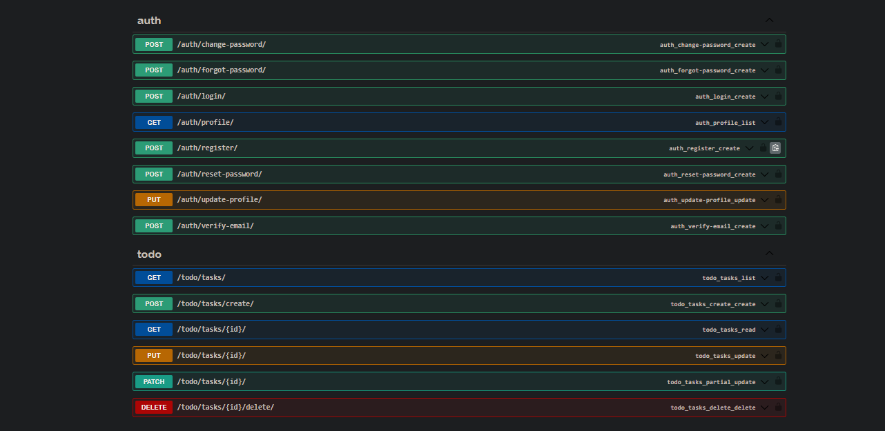

# Django Todo API

This repository contains the backend API for a Todo application built with Django and Django REST Framework. The API supports user authentication, task management, profile management, and password management, integrating seamlessly with any frontend framework.

## Features

- **User Authentication**: Register, login, and email verification.
- **User Profile Management**: View and update user profile.
- **Password Management**: Change password, forgot password, and reset password.
- **Todo Task Management**: CRUD operations for managing tasks.

## Getting Started

1. Clone the repository:
    ```bash
    git clone https://github.com/Pundit4Real/Django-Todo-api.git
    ```

2. Install dependencies and run the server:
    ```bash
    python -m venv env
    source env/bin/activate  # On Windows use `env\Scripts\activate`
    pip install -r requirements.txt
    python manage.py migrate
    python manage.py runserver
    ```

## API Documentation

- **Auth Endpoints**:
  - `POST /auth/register/`
  - `POST /auth/verify-email/`
  - `POST /auth/login/`
  - `POST /auth/change-password/`
  - `POST /auth/forgot-password/`
  - `POST /auth/reset-password/`

- **User Profile Endpoints**:
  - `GET /auth/profile/`
  - `PUT /auth/update-profile/`

- **Task Endpoints**:
  - `GET /todo/tasks/`
  - `POST /todo/tasks/create/`
  - `PUT /todo/tasks/{id}/`
  - `DELETE /todo/tasks/{id}/delete`
 
## Swagger View of the Endpoint

